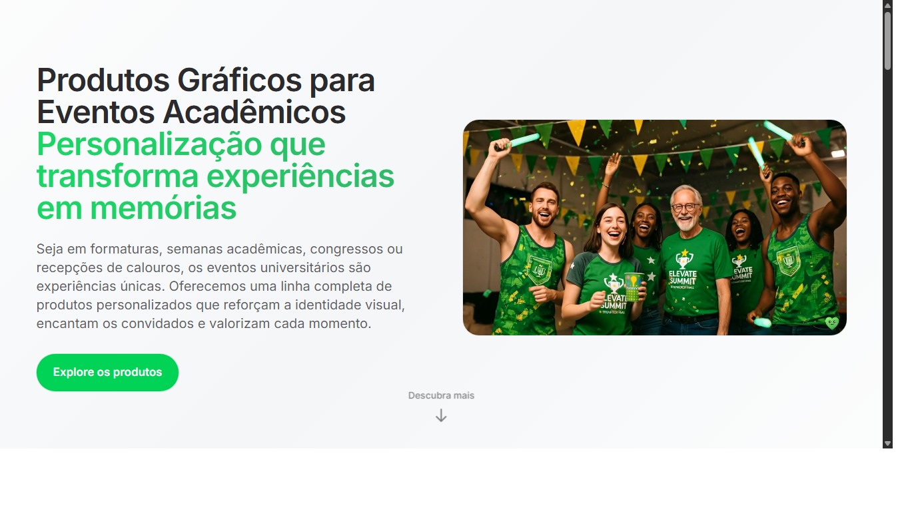



Este repositório faz parte do meu portfólio no GitHub. É uma landing page de Academico desenvolvida profissionalmente (no contexto do meu trabalho) e publicada aqui para demonstrar meu processo, padrões e qualidade de entrega.

- Tipo: Landing Page estática focada em conversão
- Tom: portfólio profissional (mostrando boas práticas e organização)

## ✨ Visão geral

- Seção hero com proposta de valor clara e CTA destacado
- Blocos de benefícios, prova social e FAQ para reduzir objeções
- Estrutura leve, responsiva e otimizada para velocidade
- Pronto para integrar ferramentas de marketing (pixel, tag manager, forms)

## 🛠️ Tecnologias e padrões

- HTML semântico e Tailwind CSS (utilitários e componetização leve)
- JavaScript vanilla para interações pontuais (sem dependências pesadas)
- Assets otimizados (imagens com lazy loading quando aplicável)
- Configuração opcional de deploy via Netlify ou GitHub Pages

## 📁 Estrutura do projeto

- index.html — entrada única com layout e seções da LP
- public/ — imagens e assets estáticos
- src/ — arquivos fonte (quando aplicável)
- 	ailwind.config.js e postcss.config.js  configuração de estilo (quando presente)
- 
etlify.toml  configuração de deploy (quando usado)

##  Como rodar localmente

Windows PowerShell:

`powershell
# Abrir no navegador (visualização simples)
Start-Process .\index.html

# ou servir em HTTP local (recomendado para testar lazy loading)
python -m http.server 8000
# Acesse: http://localhost:8000
`

## 🚀 Deploy

- Netlify: arrastar a pasta do projeto ou conectar o repositório e configurar build (se usar Tailwind)
- GitHub Pages: habilitar Pages na branch main e apontar a raiz do projeto

## 📌 Notas de design/conteúdo

- Copywriting pensado para Academico, com foco em clareza e escaneabilidade
- Componentes reutilizáveis, tokens de espaçamento e tipografia consistentes
- Preparado para testes A/B (variações de heading/CTA/ordem de blocos)

## 🧑‍💻 Sobre este projeto

Este trabalho foi desenvolvido no contexto da empresa em que atuo, e publicado aqui como parte do meu portfólio. Meu objetivo é mostrar como estruturo LPs de nicho com foco em conversão, performance e manutenção simples.

 Lucas (@svlucas7)